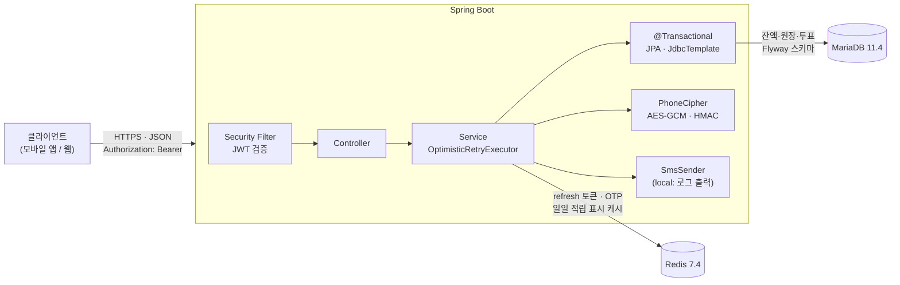

# pick-one

[](https://github.com/skan0421/pick-one/actions/workflows/ci.yml)

사소한 고민을 올리면 모르는 사람들이 몇 초 만에 골라주는 고민 투표 앱의 **백엔드**입니다.
화면보다 포인트 원장, 동시성, 개인정보 암호화 같은 설계와 문제 해결 과정을 보여주는 데 초점을 둔 포트폴리오입니다.

## 핵심 기능

- **회원**: 이메일 가입·로그인(JWT access + Redis refresh rotation, 재사용 감지 시 전 기기 로그아웃), SMS OTP 휴대폰 인증
- **고민 등록·피드**: 텍스트형(선택지 2~4개)·사진형(2장) 고민, 키셋 페이징 피드(상단 노출 → 최신순 2단계)
- **투표**: 한 고민에 한 번, 투표 즉시 선택지별 결과(%) 반환
- **포인트**: 투표 시 +1P 적립(일일 상한 50P), 100P로 내 고민 24시간 상단 노출(`Idempotency-Key` 멱등 처리)
- **지인에게 숨기기**: 연락처(최대 5,000건)를 HMAC으로만 저장해, 내 연락처에 있는 사람에게 내 고민을 노출하지 않음
- **신고·차단**: 신고 5건 누적 시 자동 숨김, 사용자 양방향 차단

## 기술 스택

| 분류 | 기술 | 이 프로젝트에서 쓰는 이유 |
|---|---|---|
| Language / Framework | Java 17, Spring Boot 4.1 | 트랜잭션·보안·검증을 표준 방식으로 구성 |
| ORM / SQL | Spring Data JPA, JdbcTemplate | 도메인 로직은 JPA, 연락처 5,000건 같은 대량 INSERT·매칭은 `JdbcTemplate.batchUpdate` 로 분리 |
| 인증 | Spring Security, OAuth2 Resource Server(JWT, HS256) | 무상태 access 토큰 검증을 프레임워크 표준 필터로 처리 |
| DB | MariaDB 11.4 (InnoDB) | 행 락·낙관적 락·유니크/FK/CHECK 제약을 동시성과 무결성의 최종 방어선으로 사용 |
| 스키마 관리 | Flyway | 스키마 변경을 `V{n}__*.sql` 버전 파일로만 관리, `ddl-auto=validate` 로 엔티티-스키마 불일치 시 기동 실패 |
| Cache / 저장소 | Redis 7.4 | Refresh 토큰, OTP 코드·쿨다운·일일 한도. `SET NX`, `INCR`, Lua 스크립트로 check-then-act 경합 제거 |
| 테스트 | JUnit 5, Testcontainers | Compose 와 같은 MariaDB·Redis 이미지로 실제 락·스냅샷 동작을 검증 (H2 로는 재현 불가) |
| 인프라 | Docker Compose, GitHub Actions | 로컬 DB·Redis 기동, PR·main push 마다 전체 테스트 실행 |

## 아키텍처



## 설계 문서

- ERD·제약·설계 메모: [docs/erd.md](docs/erd.md)
- API 명세(에러 코드, 트랜잭션 흐름, Redis 키, 동시성 검증 표): [docs/api.md](docs/api.md)
- 기획: [docs/planning.md](docs/planning.md)
- 트러블슈팅 전체 기록: [docs/troubleshooting.md](docs/troubleshooting.md)

## 핵심 설계 3가지

### 1. 포인트 잔액 + 원장 이중 구조

- `point_wallet`(회원별 현재 잔액, `version` 낙관적 락)과 `point_ledger`(모든 적립·차감 내역)를 함께 둡니다. 잔액은 빠른 조회용, 원장은 모든 변동의 근거입니다.
- 불변식 `SUM(point_ledger.amount) = point_wallet.balance` 를 포인트 동시성 테스트(`PointConcurrencyTest`)의 모든 케이스 끝에서 검증합니다.
- `chk_point_wallet_balance (balance >= 0)` CHECK 로 동시 차감에서 잔액이 음수로 저장되는 것을 DB 가 막습니다.
- `point_ledger.idempotency_key` 유니크: 적립은 서버가 `vote:{voteId}`, 차감(boost)은 클라이언트 `Idempotency-Key` 헤더를 넣어 이중 적립·이중 차감을 막습니다.
- 일일 적립 상한(50P)은 Redis 카운터가 아니라 **트랜잭션 안의 원장 `SUM`** 으로 판정합니다. Redis 는 다른 저장소라 트랜잭션 격리가 적용되지 않아 49P 에서 동시 투표 시 51P 가 될 수 있기 때문입니다. Redis 카운터는 표시용 캐시로만 씁니다.

### 2. 투표·적립 단일 트랜잭션과 낙관적 락 재시도

- 투표 INSERT → 일일 상한 확인 → 지갑 `+1` → 원장 INSERT 를 **한 트랜잭션**으로 묶어 "투표는 됐는데 포인트는 없는" 상태를 만들지 않습니다. 중복 투표는 `(member_id, question_id)` 유니크, 다른 고민의 선택지는 `(option_id, question_id)` 복합 FK 로 DB 가 막습니다.
- 같은 지갑에 동시 요청이 몰리면 `version` 충돌이 납니다. `OptimisticRetryExecutor` 가 `@Transactional` 프록시 **바깥**에서 트랜잭션 전체를 새로 시작해 재시도합니다(총 4회, `5~30ms × attempt` 무작위 백오프). 트랜잭션 안에서 호출되면 `IllegalStateException` 으로 막습니다.
- "총 시도 A ≥ 경쟁 요청 N 이면 전부 성공"을 논증하고(각 실패는 다른 요청의 커밋 1건이 원인, 그런 커밋은 최대 N-1개), 테스트 스레드 수를 그 범위 안에서 검증합니다.
- 결과 집계는 **커밋 후** 새 스냅샷으로 합니다. 트랜잭션 안에서 세면 REPEATABLE READ 스냅샷 때문에 동시에 커밋된 표가 빠집니다.

### 3. 개인정보: AES-GCM + HMAC

- 회원 휴대폰 번호는 E.164 로 정규화한 뒤 두 컬럼으로 저장합니다.
  - `phone_encrypted`: AES-256-GCM, 요청마다 12바이트 랜덤 IV, `IV || 암호문+태그` Base64. 복호화가 필요할 때만 사용
  - `phone_hmac`: HMAC-SHA256(hex 64자). 같은 번호는 같은 값이라 유니크 제약·검색·연락처 매칭에 사용
- 업로드한 연락처는 **원문 없이 HMAC 만** 저장합니다. 가입 회원이면 `hide_relation` 으로 회원 ID 와 매칭하고, 미가입 번호는 `hide_pending` 에 두었다가 그 번호가 가입·인증하면 옮깁니다.
- HMAC 을 클라이언트에서 만들지 않는 이유는 HMAC 키가 서버 비밀이기 때문입니다. 요청 DTO 의 `toString` 은 건수만 출력하고, 통합 테스트가 업로드 중 모든 로그에 번호가 없는지 확인합니다.
- AES 키와 HMAC 키는 서로 다른 값으로 환경변수에서 주입하며 코드·저장소에 기본값이 없습니다.

## 트러블슈팅 하이라이트

수치는 모두 Testcontainers(MariaDB 11.4, Redis 7.4) 통합 테스트 또는 로컬 DB 에서 실측한 값입니다. 전체 12건은 [docs/troubleshooting.md](docs/troubleshooting.md) 에 있습니다.

**1. 연락처 5,000건 저장이 느림 — IDENTITY 엔티티의 `saveAll` 은 건별 INSERT** ([상세](docs/troubleshooting.md#11-연락처-5000건-저장--identity-엔티티의-jpa-saveall-은-건별-insert))
- 문제·원인: `hide_pending` 이 IDENTITY 전략이라 Hibernate 가 INSERT 를 배치로 묶지 못하고 5,000번 왕복
- 해결: `JdbcTemplate.batchUpdate`(1,000건 분할) 저장, 회원 매칭은 엔티티 대신 `(id, phone_hmac)` 만 IN 절로 조회
- 수치: 5,000건 **JPA `saveAll` 3,068~6,675ms → `batchUpdate` 352~392ms (약 9~17배)**

**2. 피드 쿼리가 filesort + 전체 행 읽기** ([상세](docs/troubleshooting.md#4-피드-조회-explain--join-때문에-filesort-상단-노출-인덱스))
- 문제·원인: 지인 숨김 `JOIN member` 때문에 옵티마이저가 정렬 인덱스를 버림(`Using temporary; Using filesort`), 상단 노출 조건은 인덱스 없음
- 해결: 숨김·차단 조건을 `NOT EXISTS` 서브쿼리로 이동, 피드를 상단 노출/일반 2단계 키셋 조회로 분리, `idx_question_status_boosted_until` 추가(V3)
- 수치: question 3,000행 기준 일반 피드 첫 페이지 **읽은 rows 3,000 → 21**, filesort 제거

**3. 일일 적립 상한을 Redis 로 판정하면 초과 적립** ([상세](docs/troubleshooting.md#5-일일-적립-상한-판정--redis-카운터에서-원장-sum-으로))
- 문제·원인: 판정(Redis)과 커밋(DB) 저장소가 달라 트랜잭션 격리가 안 됨 → 49P 에서 동시 투표 시 51P 가능 (설계 검토에서 발견)
- 해결: 트랜잭션 안에서 원장 `SUM` 으로 판정. 같은 지갑 행 UPDATE 의 낙관적 락이 회원 단위로 적립을 직렬화
- 수치: 49P 상태에서 동시 투표 3건 → **201 3건, 적립 정확히 1건(잔액 50)**, 재시도 2회

**4. 지갑 경합에서 재시도 폭주** ([상세](docs/troubleshooting.md#7-지갑-경합의-재시도-폭주와-백오프))
- 문제·원인: 같은 지갑 행 락을 기다리던 트랜잭션들이 한꺼번에 실패하고 한꺼번에 다시 부딪힘(thundering herd). 재시도가 이론 상한 6회까지 도달
- 해결: `5~30ms × attempt` 무작위 백오프, 트랜잭션 전체 재시작 구조, "총 시도 ≥ 경쟁 수면 전부 성공" 논증으로 테스트 범위 고정
- 수치: 4스레드 경합 → **201 4건, 잔액 4, 원장 `balance_after` 1·2·3·4**, 재시도 4~6회

**5. 동시 차단이 500 — UPSERT 뒤 SELECT 가 0행 (REPEATABLE READ 스냅샷)** ([상세](docs/troubleshooting.md#10-동시-차단에서-upsert-뒤-select-가-0행--repeatable-read-스냅샷))
- 문제·원인: 진 쪽 트랜잭션은 UPSERT 전에 이미 스냅샷이 고정돼, 이긴 쪽이 막 커밋한 행을 일반 SELECT 가 보지 못함
- 해결: `SELECT ... FOR UPDATE` 잠금 읽기로 최신 커밋 버전을 읽음 (같은 원리의 투표 집계 누락·신고 자동 숨김 누락도 각각 해결: 6·12번)
- 수치: 동시 차단 3건 **`[500, 201, 500]` → `[201, 201, 201]`**, `member_block` 1행

## 테스트

```bash
./gradlew test   # Docker 실행 중이어야 함
```

- **테스트 188건**: 테스트 메서드 176개 + 파라미터 테스트 2개가 7케이스씩 펼쳐져 실행 기준 188건, 전부 GitHub Actions 에서 통과
- **커버리지 (JaCoCo, 2026-09-28 로컬 실측)**: 라인 **95.5%** (940/984), 브랜치 **83.5%** (340/407). 설정 클래스(`*Config`, `*Properties`)·DTO 패키지·Application 진입점은 측정에서 제외. 최소 기준으로 빌드를 막지는 않고 CI Job Summary 와 artifact(`jacoco-report`)로 공개합니다
  ```bash
  ./gradlew test jacocoTestReport   # build/reports/jacoco/test/html/index.html
  ```
- **Testcontainers**: 통합 테스트는 `@IntegrationTest` 하나로 MariaDB 11.4·Redis 7.4 컨테이너를 띄우고 스프링 컨텍스트를 공유합니다. 테스트용 JWT·AES·HMAC 키는 JVM 마다 랜덤 생성하므로 저장소나 CI Secrets 에 키가 없습니다.
- **CI**: [GitHub Actions](.github/workflows/ci.yml) 에서 PR·main push 마다 실행. 테스트 수와 커버리지 % 를 Job Summary 에 남기고, 커버리지 리포트는 항상, 테스트 리포트는 실패 시 artifact 로 업로드합니다.
- **동시성 테스트 16개** (스레드를 래치로 동시에 출발시켜 실제 DB·Redis 경합을 만듦)

| 영역 | 시나리오 | 기대 결과 |
|---|---|---|
| 가입 | 같은 이메일 / 같은 닉네임으로 동시 가입 (2건) | 201 1건, 409 1건 |
| 토큰 | 같은 refresh 로 동시 재발급 | 200 1건, 나머지 재사용 감지 |
| 휴대폰 인증 | 같은 번호 동시 발송 | 202 1건, 나머지 `OTP_COOLDOWN` |
| 휴대폰 인증 | 두 회원이 같은 번호를 동시 확인 | 200 1건, 409 `PHONE_ALREADY_REGISTERED` |
| 휴대폰 인증 | 틀린 코드 동시 입력 | 시도 횟수 정확히 증가 |
| 투표 | 같은 회원·같은 고민 동시 투표 | 1건만 성공, 적립 1회 |
| 투표 | 여러 회원·같은 고민 동시 투표 | 전부 성공, 각자 1P, 마지막 응답 `totalVotes` 반영 |
| 투표 | 같은 회원·여러 고민 동시 투표 (지갑 경합) | 재시도로 전부 반영, 잔액 = 원장 합계 |
| 투표 | 일일 상한 직전 동시 투표 | 적립은 상한까지만 |
| boost | 같은 `Idempotency-Key` 동시 요청 | 차감 1회, 응답 본문 동일 |
| boost | 잔액 1회분에서 다른 키로 동시 요청 | 1건 성공, 잔액 음수 불가 |
| 차단 | 같은 상대 동시 차단 | 전부 201, 행 1개 |
| 신고 | 기준 직전 / 0건에서 기준 수만큼 / 기준 미만 동시 신고 (3건) | HIDDEN 전환 누락 없음, 미만이면 ACTIVE |

## 로컬 실행

필요: JDK 17, Docker

1. 환경변수 파일 준비 (둘 다 git 미추적)
   ```bash
   cp .env.example .env                                                        # DB_PASSWORD, DB_ROOT_PASSWORD 채우기
   cp src/main/resources/application-local.yml.example src/main/resources/application-local.yml   # .env 와 같은 비밀번호 + JWT·암호화 키
   ```
   비밀값 세 가지는 환경변수로도 줄 수 있습니다.
   | 설정 | 환경변수 | 형식 |
   |---|---|---|
   | `pickone.jwt.secret` | `JWT_SECRET` | 32바이트 이상 임의 문자열 |
   | `pickone.crypto.phone-aes-key` | `PHONE_AES_KEY` | Base64 32바이트 (`openssl rand -base64 32`) |
   | `pickone.crypto.phone-hmac-key` | `PHONE_HMAC_KEY` | 32바이트 이상 임의 문자열, AES 키와 다른 값 |

   키를 바꾸면 기존 회원의 번호를 복호화·매칭할 수 없으므로 운영 중 교체에는 재암호화 마이그레이션이 필요합니다.
2. DB·Redis 기동 (MariaDB 3307, Redis 6380. Refresh 토큰이 Redis 에 저장되므로 Redis 없이는 로그인이 실패합니다)
   ```bash
   docker compose up -d
   ```
3. 앱 실행 (기본 프로필 `local`, 기동 시 Flyway 가 `src/main/resources/db/migration` 을 적용)
   ```bash
   ./gradlew bootRun
   ```
   로컬에서는 SMS 가 실제로 발송되지 않고 인증번호가 앱 로그(DEBUG)에 찍힙니다.
4. API 문서 (Swagger UI, springdoc-openapi)
   - Swagger UI: http://localhost:8080/swagger-ui/index.html
   - OpenAPI JSON: http://localhost:8080/v3/api-docs
   - 보호된 API 는 우측 상단 **Authorize** 버튼에 가입/로그인 응답의 `accessToken` 을 넣으면 호출할 수 있습니다 (Bearer JWT)
   - `pickone.swagger.enabled` 하나로 문서·UI·보안 예외를 함께 켜고 끕니다. **기본 꺼짐**이며, 로컬은 `application-local.yml` 에서 켭니다(예시 파일에 포함). 환경변수 `SWAGGER_ENABLED=true` 로도 켤 수 있습니다

스키마 변경은 항상 새 `V{n}__{설명}.sql` 파일로 추가하며, push 된 마이그레이션은 수정하지 않습니다.

## AI 활용 방식

Claude 를 페어 프로그래머로 사용했습니다.

- **직접 결정한 것**: 기획과 기능 범위, 핵심 설계 선택 — 포인트 잔액 + 원장 구조, 연락처를 원문 없이 HMAC 으로 매칭하는 방식, 일일 적립 상한을 Redis 가 아니라 원장 `SUM` 으로 판정하는 것 등
- **AI 를 활용한 것**: 결정한 설계의 구현 코드와 테스트 코드 작성
- **기록**: 설계 결정의 근거는 [docs/erd.md](docs/erd.md)·[docs/api.md](docs/api.md) 에, 구현 중 만난 문제와 해결 과정은 [docs/troubleshooting.md](docs/troubleshooting.md) 에 남겼습니다.

## 남은 작업

- **소셜 로그인(카카오·구글)**: API 설계([api.md 2.6](docs/api.md))와 스키마(V2)는 준비됨, 구현 예정
- **2차 기능**: 프로필 속성, 질문 대상 지정, 속성별 결과 분석(k-익명성) — 설계만 완료([api.md 9](docs/api.md))
- **배포**: 클라우드 배포, 실제 SMS 발송기 연동, 화면
