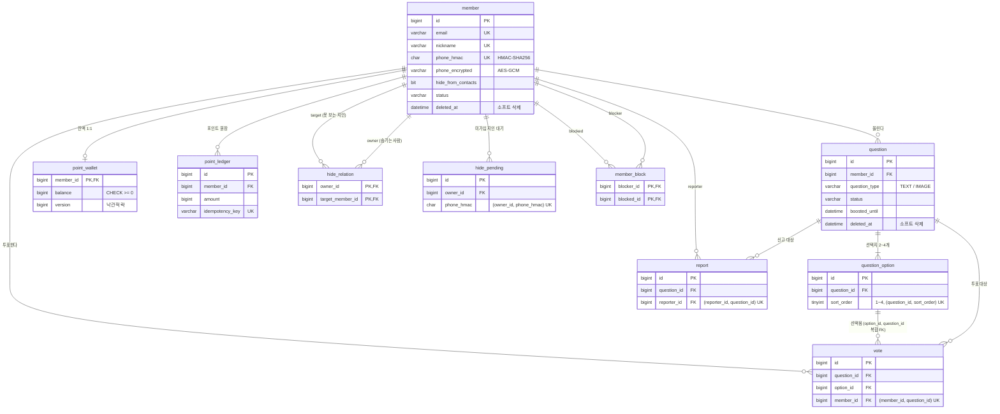

# ERD (MVP v1)

실제 스키마는 `src/main/resources/db/migration/V1__init_schema.sql` 이 기준이며, 이 문서는 그 SQL 을 설명한다.

## 관계도

PK / FK / 유니크 키 위주의 핵심 컬럼만 표시. 전체 컬럼은 아래 DBML 참고.



## 테이블 요약

| 테이블 | 역할 |
|---|---|
| `member` | 회원. 휴대폰 번호는 AES 암호화 + HMAC(검색용) 두 컬럼으로 저장 |
| `question` | 고민. 유형(TEXT / IMAGE), 상단 노출 만료 시각 |
| `question_option` | 선택지. TEXT는 2~4개(content), IMAGE는 정확히 2개(image_url) |
| `vote` | 투표. (member_id, question_id) 유니크로 중복 투표 방지, (option_id, question_id) 복합 FK로 선택지-고민 일치 보장 |
| `point_wallet` | 회원별 현재 잔액. version 컬럼으로 낙관적 락, balance >= 0 CHECK |
| `point_ledger` | 포인트 원장. 모든 적립/차감 내역. idempotency_key 유니크로 중복 처리 방지 |
| `hide_relation` | 지인 숨김 (가입한 지인). 작성자(owner)의 고민을 target에게 숨김 |
| `hide_pending` | 지인 숨김 대기 (아직 가입 안 한 번호의 HMAC). 가입 시 hide_relation으로 이동 |
| `member_block` | 사용자 차단 |
| `report` | 고민 신고 |

## 공통 규칙

- PK: `BIGINT AUTO_INCREMENT` (관계 테이블 `hide_relation`, `member_block` 과 1:1 인 `point_wallet` 은 예외)
- 컬럼명: snake_case
- 문자셋: `utf8mb4` / `utf8mb4_unicode_ci`, 엔진: InnoDB
- 시각 컬럼: `DATETIME(6)` (Hibernate `LocalDateTime` 매핑과 일치)
- boolean 컬럼: `BIT(1)` (Hibernate 가 MariaDB 에서 boolean 을 BIT 로 매핑하므로 `ddl-auto=validate` 통과용)
- 공통 컬럼: `created_at`, `updated_at` (필요한 테이블만)
- 삭제: 회원·고민은 소프트 삭제(`deleted_at`), 나머지는 실제 삭제
- 원본 연락처 번호는 저장하지 않음 (HMAC만 저장)
- 제약 이름 규칙: `uk_테이블_컬럼`, `idx_테이블_컬럼`, `fk_테이블_참조대상`, `chk_테이블_의미`

## DB 제약 (CHECK)

| 이름 | 조건 | 막는 것 |
|---|---|---|
| `chk_point_wallet_balance` | `balance >= 0` | 잔액이 음수가 되는 차감 |
| `chk_question_option_sort_order` | `sort_order BETWEEN 1 AND 4` | 선택지 순서 범위 밖 값 |
| `chk_hide_relation_not_self` | `owner_id <> target_member_id` | 자기 자신에게 숨기기 |
| `chk_member_block_not_self` | `blocker_id <> blocked_id` | 자기 자신 차단 |

## DBML (dbdiagram.io)

```dbml
Table member {
  id bigint [pk, increment]
  email varchar(100) [not null, unique]
  password_hash varchar(255) [not null, note: 'BCrypt']
  nickname varchar(30) [not null, unique]
  phone_encrypted varchar(255) [not null, note: 'AES-GCM 암호화 (복호화 가능)']
  phone_hmac char(64) [not null, unique, note: 'HMAC-SHA256 (검색/매칭 전용)']
  hide_from_contacts bit(1) [not null, default: 0, note: '지인에게 숨기기 ON/OFF']
  status varchar(20) [not null, note: 'ACTIVE / SUSPENDED']
  created_at datetime(6) [not null]
  updated_at datetime(6) [not null]
  deleted_at datetime(6)
}

Table question {
  id bigint [pk, increment]
  member_id bigint [not null, ref: > member.id]
  question_type varchar(10) [not null, note: 'TEXT / IMAGE']
  content varchar(300) [not null, note: '고민 본문']
  status varchar(20) [not null, note: 'ACTIVE / HIDDEN(신고 누적) / CLOSED']
  boosted_until datetime(6) [note: '포인트로 상단 노출 시 만료 시각']
  created_at datetime(6) [not null]
  updated_at datetime(6) [not null]
  deleted_at datetime(6)

  indexes {
    (status, created_at) [note: '피드 조회']
    (member_id, created_at) [note: '내 고민 목록']
  }
}

Table question_option {
  id bigint [pk, increment]
  question_id bigint [not null, ref: > question.id]
  sort_order tinyint [not null, note: '1~4. CHECK chk_question_option_sort_order']
  content varchar(20) [note: 'TEXT 유형일 때']
  image_url varchar(500) [note: 'IMAGE 유형일 때']

  indexes {
    (question_id, sort_order) [unique]
    (id, question_id) [unique, note: 'vote 의 복합 FK 참조 대상']
  }
}

Table vote {
  id bigint [pk, increment]
  question_id bigint [not null, ref: > question.id]
  option_id bigint [not null]
  member_id bigint [not null, ref: > member.id]
  created_at datetime(6) [not null]

  indexes {
    (member_id, question_id) [unique, note: '중복 투표 방지']
    (question_id, option_id) [note: '결과 집계']
  }
}
// 선택지가 해당 고민에 속하는지 DB 에서 보장하는 복합 FK
Ref fk_vote_option: vote.(option_id, question_id) > question_option.(id, question_id)

Table point_wallet {
  member_id bigint [pk, ref: - member.id]
  balance bigint [not null, default: 0, note: 'CHECK chk_point_wallet_balance: balance >= 0']
  version bigint [not null, default: 0, note: '낙관적 락']
  updated_at datetime(6) [not null]
}

Table point_ledger {
  id bigint [pk, increment]
  member_id bigint [not null, ref: > member.id]
  amount bigint [not null, note: '적립 +, 차감 -']
  balance_after bigint [not null, note: '처리 후 잔액 (검증용)']
  tx_type varchar(30) [not null, note: 'VOTE_REWARD / BOOST_USE / SIGNUP_BONUS ...']
  ref_type varchar(30) [note: 'VOTE / QUESTION ...']
  ref_id bigint [note: '관련 엔티티 ID']
  idempotency_key varchar(100) [not null, unique, note: '같은 요청 중복 처리 방지']
  created_at datetime(6) [not null]

  indexes {
    (member_id, created_at) [note: '내 포인트 내역']
  }
}

Table hide_relation {
  owner_id bigint [not null, ref: > member.id, note: '숨기기를 켠 작성자']
  target_member_id bigint [not null, ref: > member.id, note: '고민을 못 보는 지인']
  created_at datetime(6) [not null]
  Note: 'CHECK chk_hide_relation_not_self: owner_id <> target_member_id'

  indexes {
    (owner_id, target_member_id) [pk]
    target_member_id [note: '피드 조회 시 제외 대상 검색']
  }
}

Table hide_pending {
  id bigint [pk, increment]
  owner_id bigint [not null, ref: > member.id]
  phone_hmac char(64) [not null, note: '아직 가입 안 한 연락처']
  created_at datetime(6) [not null]

  indexes {
    (owner_id, phone_hmac) [unique]
    phone_hmac [note: '신규 가입 시 매칭']
  }
}

Table member_block {
  blocker_id bigint [not null, ref: > member.id]
  blocked_id bigint [not null, ref: > member.id]
  created_at datetime(6) [not null]
  Note: 'CHECK chk_member_block_not_self: blocker_id <> blocked_id'

  indexes {
    (blocker_id, blocked_id) [pk]
  }
}

Table report {
  id bigint [pk, increment]
  question_id bigint [not null, ref: > question.id]
  reporter_id bigint [not null, ref: > member.id]
  reason varchar(30) [not null, note: 'ABUSE / PERSONAL_INFO / SPAM / ETC']
  detail varchar(200) [note: '신고 상세 (선택, V4)']
  status varchar(20) [not null, note: 'RECEIVED / ACCEPTED / REJECTED']
  created_at datetime(6) [not null]

  indexes {
    (reporter_id, question_id) [unique, note: '중복 신고 방지']
  }
}
```

## 설계 메모

- **포인트는 잔액(point_wallet) + 원장(point_ledger) 이중 구조.**
  잔액은 빠른 조회용, 원장은 모든 변동의 근거. `SUM(ledger.amount) = wallet.balance` 가 항상 성립해야 함.
  `balance >= 0` CHECK 는 동시 차감 경합에서 낙관적 락이 놓친 경우에도 잔액이 음수로 저장되지 않게 하는 마지막 방어선.
- **vote 에 question_id 를 중복 저장**하는 이유: option_id 만으로는 "한 고민에 한 번만 투표" 유니크 제약을 걸 수 없기 때문.
- **vote → question_option 은 (option_id, question_id) 복합 FK.**
  option_id 하나만 FK 로 걸면 "1번 고민에 투표하면서 2번 고민의 선택지를 고르는" 요청을 DB 가 막지 못한다.
  question_option 에 `(id, question_id)` 유니크를 두고 그것을 참조해, 선택지가 해당 고민에 속하는지를 애플리케이션이 아니라 DB 에서 보장한다.
- **자기 참조 관계(숨기기, 차단)는 CHECK 로 자기 자신을 막는다.** 애플리케이션 검증을 빠뜨려도 데이터가 오염되지 않도록.
- **선택지 개수 규칙(TEXT 2~4 / IMAGE 2)은 DB 가 아니라 등록 API 에서 검증.** 행 개수 제약은 CHECK 로 표현할 수 없기 때문. 단, `sort_order` 범위(1~4)는 CHECK 로 막는다.
- **boolean 은 BIT(1), 시각은 DATETIME(6)**: Hibernate MariaDB 방언의 기본 매핑과 맞춰 `ddl-auto=validate` 를 통과시키기 위함. `sort_order` 는 TINYINT 이므로 엔티티에서 `Byte` 또는 `@JdbcTypeCode(SqlTypes.TINYINT)` 로 매핑해야 한다.
- 추후 추가 예정: 랭킹, 알림, 카테고리, 한 줄 조언 → Flyway 버전 파일로 테이블 추가
